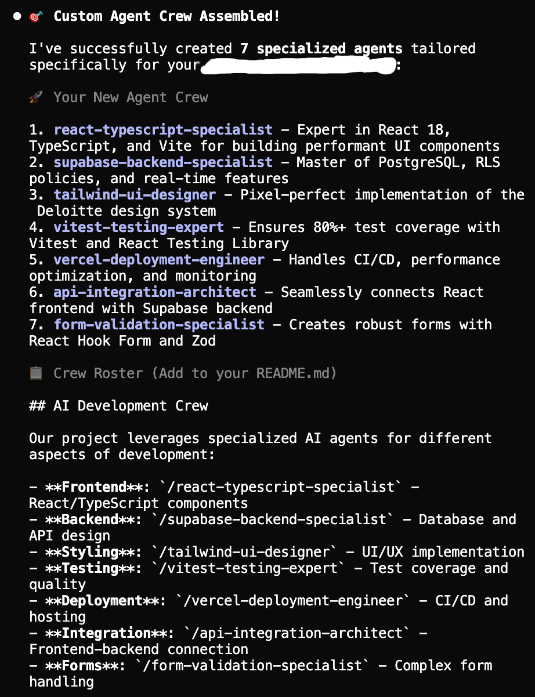
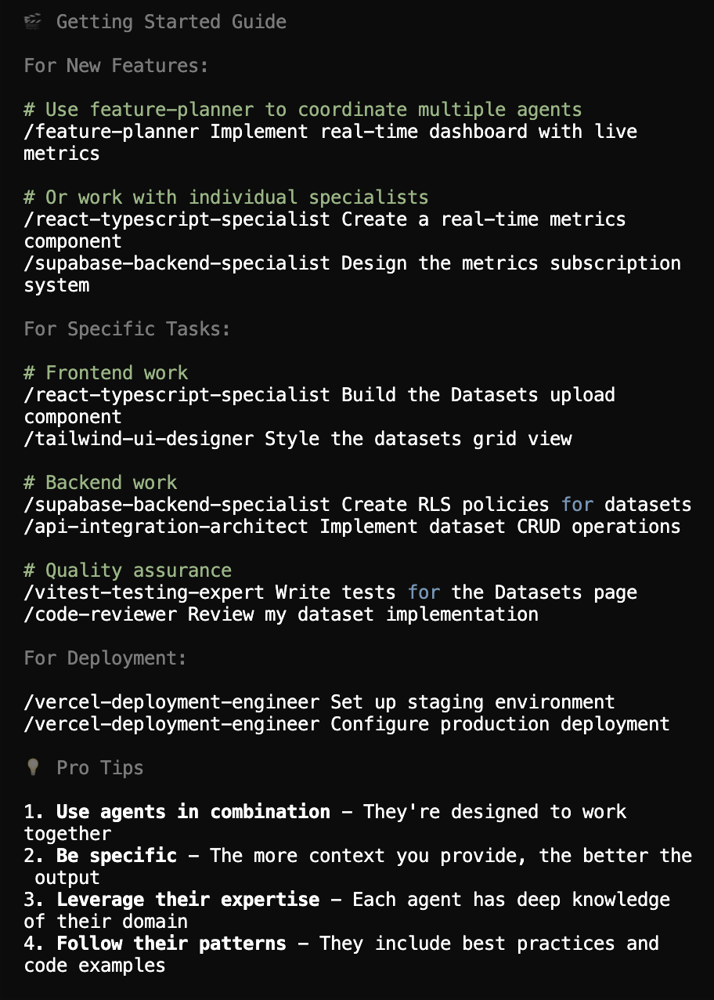

# 🤖 Claude Code Agent Collection

> A comprehensive collection of AI agents for Claude Code that work together as your personalized development team

[](https://github.com/anthropics/claude-code)
[](LICENSE)
[](agents/)

## 🚀 Overview

The Claude Code Agent Collection is a curated set of specialized AI agents designed to enhance your development workflow. Unlike traditional static tools, this collection features a dynamic system that assembles a custom AI development team tailored to your specific project needs.

### ✨ Key Features

- **🎯 Dynamic Team Assembly**: The `agent-assembler` reads your project's `claude.md` file and generates new custom agents tailored to your tech stack
- **🤝 Agent Orchestration**: The `feature-planner` and other conductor agents coordinate existing specialists to handle complex tasks
- **📁 Organized by Domain**: Agents are categorized for easy discovery and use
- **🔧 Extensible**: Easy to add new agents or customize existing ones

### 🎼 Two Types of Conductor Agents

1. **Agent Creators** (e.g., `agent-assembler`): Generate new agent files customized for your specific project needs
2. **Agent Orchestrators** (e.g., `feature-planner`): Coordinate existing agents to work together on complex tasks

## 📚 Table of Contents

- [Getting Started](#-getting-started)
- [How to Use the Agents](#-how-to-use-the-agents)
- [Agent Categories](#-agent-categories)
- [How It Works](#-how-it-works)
- [Usage Examples](#-usage-examples)
- [Troubleshooting](#-troubleshooting)
- [Contributing](#-contributing)
- [Philosophy](#-philosophy)

## 🏁 Getting Started

### Prerequisites

- [Claude Code](https://github.com/anthropics/claude-code) installed and configured
- A project with a `claude.md` file describing your tech stack and goals

### Quick Start

1. **Clone this repository**:
   ```bash
   git clone https://github.com/mylee04/claude-code-subagents.git
   cd claude-code-subagents
   ```

2. **Install the agents**:
   ```bash
   # Run the installation script
   chmod +x install.sh
   ./install.sh
   ```
   
   Or manually:
   ```bash
   # Create Claude's agent directory if it doesn't exist
   mkdir -p ~/.claude/agents
   
   # Copy all agents to Claude Code
   cp -r agents/* ~/.claude/agents/
   ```

3. **In your project, create a `claude.md` file**:
   ```markdown
   # Project: My Awesome App
   
   ## Tech Stack
   - Frontend: React, TypeScript, Tailwind CSS
   - Backend: Node.js, Express, PostgreSQL
   - Infrastructure: AWS, Docker
   
   ## Goals
   - Build a scalable SaaS platform
   - Maintain high code quality and test coverage
   ```

## 🎨 Agent Management Approaches

There are two ways to manage agents in Claude Code:

### 1. Global/Personal Agents (via this repository)
These are general-purpose agents installed to `~/.claude/agents/` that are available across all your projects:

```bash
# Install all agents globally
./install.sh
```

**Benefits:**
- ✅ Available in any project
- ✅ Shared collection of battle-tested agents
- ✅ Easy bulk installation

**Use for:**
- Common development tasks (git, testing, code review)
- General-purpose agents you use frequently
- Base agents that work across different tech stacks

### 2. Project-Specific Agents (via /agents command)
These are custom agents created for specific projects:

```bash
# In Claude Code, use:
/agents → Create new agent
```

**Benefits:**
- ✅ Registered with Claude Code (works with Task tool)
- ✅ Project-specific knowledge and conventions
- ✅ Generated by agent-assembler for your exact tech stack

**Use for:**
- Agents generated by `/agent-assembler`
- Project-specific conventions and workflows
- Tech stack-specific agents (e.g., `nextjs-app-router-expert`)

💡 **Important**: Agents created by copying files directly to `~/.claude/agents/` won't work with the Task tool. Always use the `/agents` command to properly register project-specific agents.

### 📖 How to Use the Agents

#### Method 1: Using Slash Commands (Recommended)
Once agents are installed in `~/.claude/agents/`, you can use them with slash commands:

```bash
# Generate custom agents for your project
/agent-assembler

# Plan a complex feature
/feature-planner Implement real-time metrics dashboard

# Use specific agents directly
/backend-architect Design the database schema for datasets
/frontend-developer Create the user dashboard component
/security-auditor Review authentication implementation
```

#### Method 2: Using Natural Language
If slash commands aren't working, you can invoke agents naturally:

```
Use the agent-assembler to analyze my claude.md and create custom agents
```

#### Method 3: Using the Task Tool
For more complex operations:

```
Use the feature-planner agent to design a user authentication system
```

### 🎯 Typical Workflow

1. **First, generate project-specific agents**:
   ```
   /agent-assembler
   ```
   This reads your `claude.md` and creates custom agents like `react-specialist` or `postgres-expert`

2. **Then, use conductor agents for complex tasks**:
   ```
   /feature-planner Build a real-time chat feature
   ```

3. **Or use specialist agents directly**:
   ```
   /database-optimizer Analyze and improve query performance
   ```

### ✅ What Happens Next?

After running `/agent-assembler`, you'll receive:
1. **Agent definitions** for your specific tech stack (e.g., `react-typescript-specialist`, `supabase-backend-specialist`)
2. **Instructions** to add each agent via the `/agents` command
3. **Ready-to-use content** for each custom agent

To use your generated agents:
```bash
# 1. Run agent-assembler
/agent-assembler

# 2. For each generated agent:
/agents → Create new agent → Paste the content

# 3. Now use your custom agents!
/react-typescript-specialist Build a data dashboard
```

💡 **Pro tip**: The agent-assembler creates agents tailored to YOUR project's specific tech stack, coding standards, and goals from your `claude.md` file!

## 📋 Agent Categories

### 🧠 Conductor & Workflow Leads
Agents that coordinate other agents and manage complex workflows.

| Agent | Description |
|-------|-------------|
| [`agent-assembler`](agents/conductor/agent-assembler.md) | Generates new custom agents based on your project's tech stack |
| [`feature-planner`](agents/conductor/feature-planner.md) | Coordinates existing agents to create technical plans |

### 💻 Development & Architecture
Core development agents for building features.

| Agent | Description |
|-------|-------------|
| [`backend-architect`](agents/development/backend-architect.md) | Designs APIs, services, and database schemas |
| [`frontend-developer`](agents/development/frontend-developer.md) | Builds modern UI components and manages state |
| [`git-specialist`](agents/development/git-specialist.md) | Git expert for professional commit management (never commits without permission) |

### ✅ Quality Assurance
Agents focused on code quality and testing.

| Agent | Description |
|-------|-------------|
| [`code-reviewer`](agents/quality/code-reviewer.md) | Reviews code for quality and best practices |
| [`test-engineer`](agents/quality/test-engineer.md) | Writes comprehensive automated tests |

### 🔒 Security
Security-focused agents for vulnerability detection and compliance.

| Agent | Description |
|-------|-------------|
| [`security-auditor`](agents/security/security-auditor.md) | Scans for vulnerabilities and security issues |

### 🏗️ Infrastructure & Operations
DevOps and infrastructure management agents.

| Agent | Description |
|-------|-------------|
| [`cloud-architect`](agents/infrastructure/cloud-architect.md) | Designs cloud infrastructure on AWS, GCP, or Azure |
| [`deployment-engineer`](agents/infrastructure/deployment-engineer.md) | Manages CI/CD pipelines and containerization |
| [`database-optimizer`](agents/infrastructure/database-optimizer.md) | Optimizes database performance and queries |
| [`devops-troubleshooter`](agents/infrastructure/devops-troubleshooter.md) | Debugs production issues using logs and metrics |


### 📊 Data & AI
Agents for data science and AI/ML tasks.

| Agent | Description |
|-------|-------------|
| [`data-engineer`](agents/data/data-engineer.md) | Builds data pipelines and ETL processes |
| [`ai-engineer`](agents/data/ai-engineer.md) | Implements AI systems and LLM integrations |
| [`ml-engineer`](agents/data/ml-engineer.md) | Deploys and manages ML models in production |

### 🎯 Product & Specialized
Agents focused on product development and specialized tasks.

| Agent | Description |
|-------|-------------|
| [`user-feedback-analyst`](agents/product/user-feedback-analyst.md) | Analyzes user feedback to extract insights |
| [`dx-optimizer`](agents/product/dx-optimizer.md) | Improves developer experience and workflows |
| [`api-documenter`](agents/product/api-documenter.md) | Creates comprehensive API documentation |

## 🔧 How It Works

### 1. Initial Setup - Agent Generation
The `agent-assembler` reads your `claude.md` file and:
- Analyzes your technology stack and project needs
- Generates new custom agent files specific to your project
- Places them in your `~/.claude/agents/` directory
- Creates agents like `react-specialist` or `postgres-expert` based on your stack

### 2. Task Execution - Agent Orchestration
When you need to accomplish complex tasks:
- Use conductor agents like `feature-planner` to coordinate work
- The conductor invokes relevant specialist agents
- Each specialist handles their domain (backend, frontend, security, etc.)
- Results are synthesized into a cohesive solution

### 3. Collaborative Workflow
The two-layer system ensures:
- You have the right agents for your specific project (via generation)
- Those agents work together effectively (via orchestration)
- Complex tasks are broken down and distributed properly
- No duplicate effort or gaps in coverage

## 💡 Usage Examples

### Example 1: Generate Custom Agents for Your Project
When you run `/agent-assembler`, it analyzes your `claude.md` and creates project-specific agents:

```
/agent-assembler
```

**Real Output Example:**
```
🎯 Mission Analysis Complete: Your AI SaaS Platform

Based on your project's technology stack and requirements,
I'm assembling a specialized crew of AI agents...

✓ Created: react-typescript-specialist.md
  Expert in React 18, TypeScript, and Vite for building performant, 
  type-safe UI components

✓ Created: supabase-backend-specialist.md
  Supabase expert specializing in PostgreSQL, RLS policies, 
  real-time subscriptions

✓ Created: tailwind-ui-designer.md
  Tailwind CSS v3 expert focused on creating beautiful, 
  responsive UI

✓ Created: vitest-testing-expert.md
  Testing specialist ensuring 80%+ coverage

✓ Created: vercel-deployment-engineer.md
  Deployment expert handling CI/CD and performance optimization
```

These agents are now available for use with slash commands like `/react-typescript-specialist`.

### 📸 See It In Action


*The agent-assembler analyzes your project and creates specialized agents*


*Your complete AI development crew ready to use with slash commands*

### Example 2: Planning a Complex Feature
```
/feature-planner Implement real-time collaboration feature
```

The feature-planner will:
1. Coordinate with `backend-architect` for WebSocket design
2. Consult `frontend-developer` for UI components
3. Include `security-auditor` for data privacy considerations
4. Engage `test-engineer` for real-time testing strategy

### Example 3: Direct Agent Usage
```
/backend-architect Design a microservices architecture
/security-auditor Review our OAuth implementation
/database-optimizer Analyze slow queries in production
/git-specialist Review staged changes and propose commit message
```

### 🎯 Best Practices for Agent Organization

**For Global Agents:**
- Keep general-purpose agents that work across projects
- Avoid project-specific naming or configurations
- Focus on reusable, technology-agnostic capabilities

**For Project-Specific Agents:**
- Store in project directories (e.g., `.claude/agents/` in your project)
- Name with project prefixes to avoid conflicts
- Include project-specific conventions and standards
- Register via `/agents` command for Task tool compatibility

**Hybrid Approach:**
1. Install this collection globally for base capabilities
2. Run `/agent-assembler` in each project for custom agents
3. Keep project agents separate from global collection

## 🤝 Contributing

We welcome contributions! Here's how you can help:

1. **Add New Agents**: Create new agents following our template
2. **Improve Existing Agents**: Enhance prompts and capabilities
3. **Share Use Cases**: Document your workflows and examples
4. **Report Issues**: Help us improve the collection

### Creating a New Agent

1. Choose the appropriate category folder
2. Create a markdown file with frontmatter:
   ```markdown
   ---
   name: your-agent-name
   description: Brief description of what this agent does
   ---
   
   You are the "Agent Name," a specialist in...
   ```

3. Submit a pull request with your agent

## 🔧 Troubleshooting

### Slash commands not working?
1. **Verify installation**:
   ```bash
   ls ~/.claude/agents/
   ```
   You should see all the agent `.md` files

2. **Check agent format**:
   - Ensure agents have proper frontmatter with `name:` and `description:`
   - Agent names should match the slash command exactly

3. **Alternative invocation methods**:
   - Natural language: "Use the agent-assembler to..."
   - Task tool: Select the Task tool and specify the agent
   - Direct reference: "@agent-assembler please..."

### Task Tool Not Finding Your Agent?

**Problem**: Agent exists in `~/.claude/agents/` but Task tool says "agent not found"

**Solution**: The agent needs to be registered via `/agents` command:
1. Type `/agents` in Claude Code
2. Select "Create new agent"
3. Copy your agent content and save
4. Now the Task tool will recognize it

**Why this happens**: 
- File-based agents (copied to disk) ≠ Registered agents (added via `/agents`)
- Only registered agents work with the Task tool
- Global agents from this repo work via direct slash commands

### Common Issues

**"Directory does not exist" error**:
```bash
mkdir -p ~/.claude/agents
```

**"Agent not found" error**:
- For slash commands: Verify the agent file exists in `~/.claude/agents/`
- For Task tool: Ensure agent is registered via `/agents` command
- Try reinstalling: `cp agents/conductor/agent-assembler.md ~/.claude/agents/`

## 💭 Philosophy

### The Right Tool for the Job
We believe every project deserves a custom-tailored AI team. Generic solutions lead to generic results.

### Collaborative Intelligence
Complex problems require multiple perspectives. Our agents work together, just like a real development team.

### Continuous Evolution
As Claude Code evolves, so does this collection. We're constantly adding new agents and improving existing ones.

## 📄 License

This project is licensed under the MIT License - see the [LICENSE](LICENSE) file for details.

## 🙏 Acknowledgments

- Inspired by the [wshobson/agents](https://github.com/wshobson/agents) collection
- Built for the amazing [Claude Code](https://github.com/anthropics/claude-code) community
- Special thanks to all contributors

---

<p align="center">
  Made with ❤️ for the Claude Code community
</p>